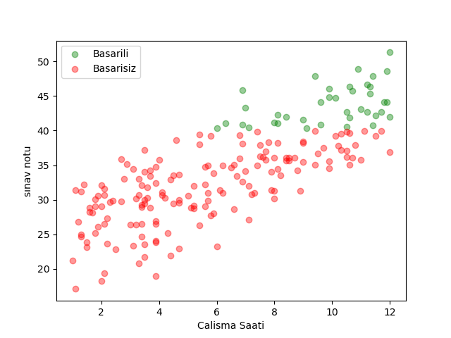

Öğrenci Sınav Başarı Tahmini (KNN Sınıflandırma)
Bu proje, öğrencilerin çalışma saatlerine bakarak sınavdan geçip geçmeyeceklerini tahmin eden temel bir Makine Öğrenmesi çalışmasıdır.
Projede sınıflandırma problemi için K-Nearest Neighbors (K-En Yakın Komşu) algoritması kullanılmıştır.

Proje Özeti
Bu çalışma kapsamında aşağıdaki adımlar uygulanmıştır:

Veri Görselleştirme: Çalışma saatleri ve notlar arasındaki ilişki matplotlib ile analiz edildi.

Veri Ön İşleme (Preprocessing): * Sınav notları 40 barajına göre "Başarılı (1)" ve "Başarısız (0)" olarak etiketlendi.

Veriler arasındaki ölçek farkını ortadan kaldırmak için Min-Max Normalizasyonu uygulandı.

Model Eğitimi: Veri seti %80 eğitim ve %20 test olarak ayrıldı.

Hiperparametre Optimizasyonu: En iyi sonucu veren K değerini bulmak için 1'den 10'a kadar denemeler yapıldı.

Algoritma Nasıl Çalışıyor?
KNN (K-Nearest Neighbors), yeni bir veri noktasının hangi grupta olduğunu, ona en yakın olan komşularının çoğunluğuna bakarak karar verir.

Sonuçlar
Model, farklı k değerleri için test edildi ve doğruluk (accuracy) oranları terminal ekranında paylaşıldı. Örnek çıktı:

k=3 için Doğruluk Oranı: %85

